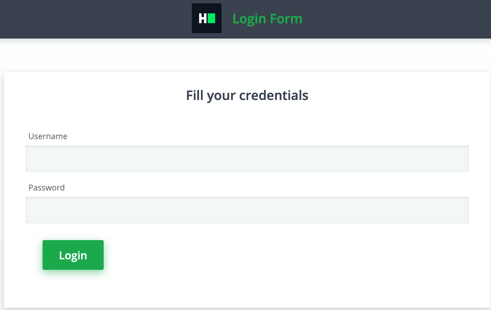

## Environment:
- Java version: 1.8
- Maven version: 3.*
- Selenium HtmlUnitDriver: 2.52.0

## Read-Only Files:
- src/test/*
- website/*
- src/main/java/com/hackerrank/selenium/server/*

## Requirements:
In this challenge, you are going to use the Selenium WebDriver, the HtmlUnitDriver, which uses the HtmlUnit headless browser. This means you don't need to set up the browser (like Firefox or Chrome) nor a web driver executable (like FirefoxDriver or ChromeDriver). Every web page has web elements (aka DOM objects) with unique names or ids. Names are usually unique, but this is not a restriction.
 

There is a class `WebAuthenticator` that has the following method:
 
 `authenticateAndGetText`:
   - Upon browsing the supplied URL, it will display the login form, which should be authenticated. For this application, the username is `admin` and the password is `admin`.
   - It needs to return the body text of the web page after authentication.
   - It has 2 parameters, one web driver and one secure web page URL.
    
The login form looks like the following:



Your task is to complete the implementation of WebAuthenticator so that the unit tests pass while running the tests.

## Commands
- run: 
```bash
mvn clean package; java -jar target/selenium-java-login-automation-1.0.jar
```
- install: 
```bash
mvn clean install
```
- test: 
```bash
mvn clean test
```
